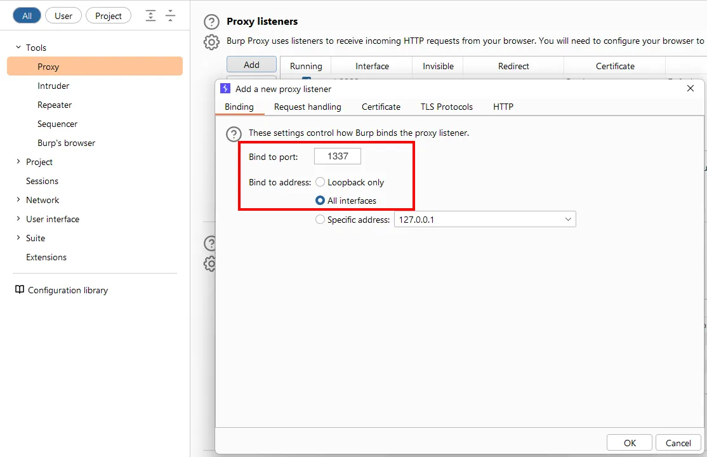
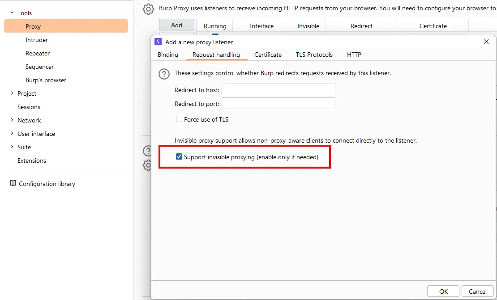
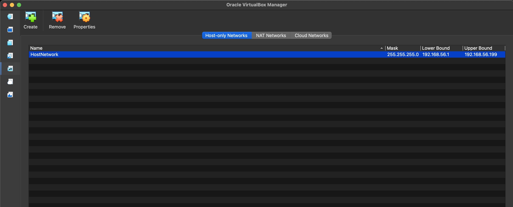
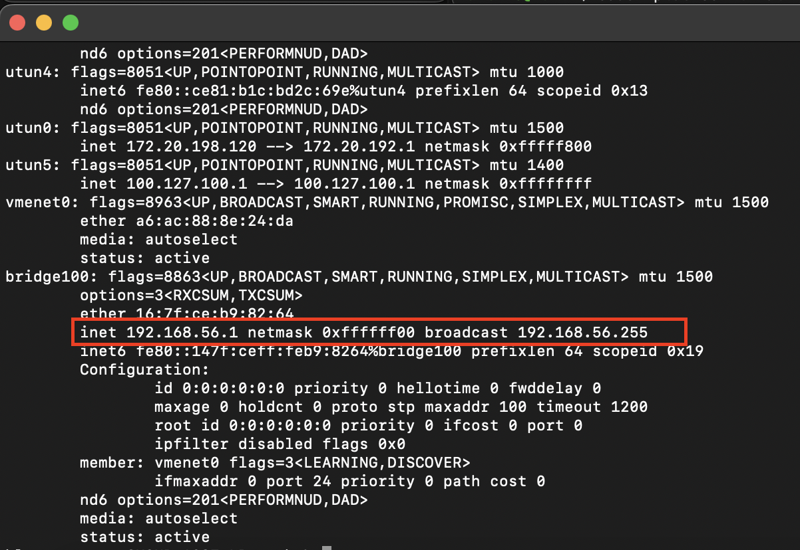
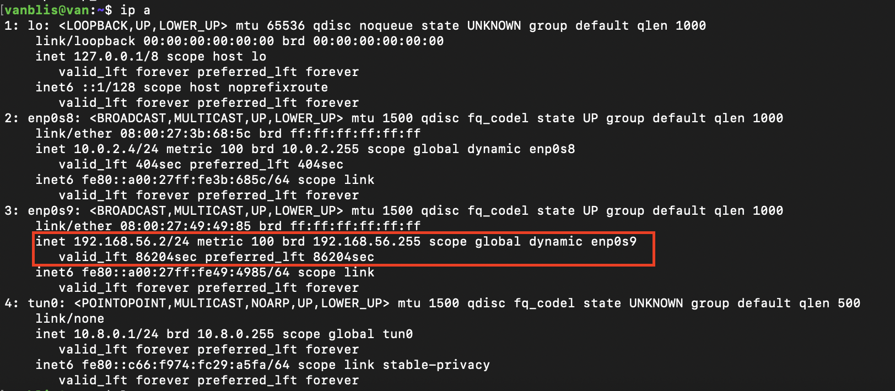
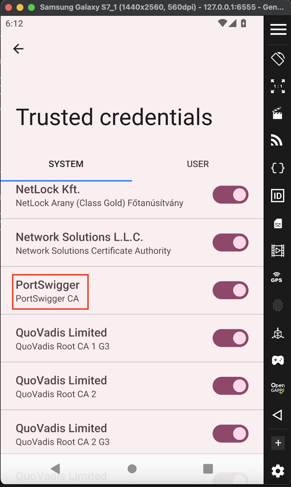

# Genymotion to Burp Suite Proxy Setup Walkthrough

This repository provides a step-by-step guide to routing traffic from a **Genymotion Android Emulator** through an **Ubuntu VM (OpenVPN Gateway)** to **Burp Suite** running on your host machine. This setup is ideal for mobile penetration testing, especially when dealing with apps that require transparent proxying or custom network configurations.

## Architecture Overview

1. **Host Machine**: Runs Burp Suite and Genymotion.
2. **Ubuntu VM**: Acts as a VPN Gateway using OpenVPN and `iptables` to redirect traffic to the Host's Burp Suite listener.
3. **Genymotion**: Android device connects to the Ubuntu VM via VPN.

---

## 1. Burp Suite Configuration (Host)

Before configuring the network, prepare Burp Suite to receive external traffic.

1. Open Burp Suite and navigate to **Proxy** > **Proxy settings**.
2. Click **Add** to create a new Proxy Listener:
* **Bind to port**: `1337` (or your preferred port).
* **Bind to address**: Select **All interfaces**.

3. Switch to the **Request handling** tab:
* Check the box for **Support invisible proxying**.

> **Note:** Invisible proxying allows Burp to handle traffic from clients that are not "proxy-aware."


4. Click **OK**.

---

## 2. Ubuntu VM Setup (VirtualBox)

The Ubuntu VM acts as the intermediary gateway.

### A. Network Configuration

To allow communication between the Host and the VM, we use a **Host-only Adapter**.

1. In VirtualBox, go to **File** > **Tools** > **Network Manager**.
2. Create a new **Host-only Network** (e.g., `vboxnet0`). Note the IPv4 address (usually `192.168.56.1`).

3. Select your Ubuntu VM > **Settings** > **Network**.
4. Set **Adapter 1** to **NAT** (for internet access).
5. Set **Adapter 2** to **Host-only Adapter** and select `vboxnet0`.

6. Start the VM and verify connectivity:
* On VM: `ping 192.168.56.1` (Ping the host).

* On Host: `ping 192.168.56.2`.



### B. OpenVPN Installation

We use an automated script to set up the VPN server.

```bash
git clone https://github.com/angristan/openvpn-install.git
cd openvpn-install
sudo su
./openvpn-install interactive # set the ip address to the host only adapter ip address of the vm. Provide client name and select passwordless client. Keep other settings default when asked.
```

* **IP Address**: Use the VM's **Host-only adapter IP**.
* **Client Name**: e.g., `android-client`.
* **Password**: Select **1** (No password).
* Keep other settings as default.

Once finished, an `.ovpn` file is generated. To transfer it to your emulator:

```bash
# In the folder containing the .ovpn file
python3 -m http.server 8000

```

### C. Routing & Iptables Configuration

Redirect incoming VPN traffic (port 80/443) to the Host's Burp Suite IP.

```bash
# check for existing route
sudo iptables -t nat -L -n -v

# Flush existing rules
sudo iptables -F
sudo iptables -t nat -A PREROUTING -p tcp --dport 80 -j DNAT --to-destination 192.168.56.1:1337
sudo iptables -t nat -A PREROUTING -p tcp --dport 443 -j DNAT --to-destination 192.168.56.1:1337

# Enable forwarding (Replace enp0s9 with your host-only interface name)
sudo iptables -A FORWARD -i tun0 -o enp0s9 -j ACCEPT
sudo iptables -A FORWARD -i enp0s9 -o tun0 -m state --state ESTABLISHED,RELATED -j ACCEPT
sudo iptables -t nat -A POSTROUTING -s 10.8.0.0/24 -o enp0s9 -j MASQUERADE

```

---

## 3. Genymotion Android Emulator Setup

### A. Device Preparation

1. Launch Genymotion and create a device (Android 11 or 12 recommended).
2. Ensure **Root Access** is enabled in the device settings.

### B. Install Burp CA Certificate

To decrypt HTTPS traffic, the Burp certificate must be installed as a **System** certificate.

1. Export the Burp certificate (DER format) from Burp Suite. Visit http://burpsuite on a broswer proxied to burpsuite and click to download the certificate.
2. Convert and rename the certificate:

```bash
# Convert DER to PEM
openssl x509 -inform der -in cacert.der -out burp.pem

# Get the subject_hash_old (e.g., 9a5ba575)
openssl x509 -inform PEM -subject_hash_old -in burp.pem | head -1

# Rename the file using the hash + .0
mv burp.pem 9a5ba575.0

```

3. Push to the device via ADB (Ensure you have adb installed on your host - https://www.xda-developers.com/install-adb-windows-macos-linux/):

```bash
adb shell
> su
> mount -o  remount,rw / 
> exit
exit
adb push 9a5ba575.0 /system/etc/security/cacerts/
adb shell "chmod 644 /system/etc/security/cacerts/9a5ba575.0"
```
If you get a permission denied error, try the below. This is as a result of how root access on different android verions and Genymotion work.

The above works for genymotion android <11. while the below method works for android 12+

```bash
adb push 9a5ba575.0 /sdcard/
adb shell
> su
> cp /sdcard/9a5ba575.0 /system/etc/security/cacerts/
> chmod 644 /system/etc/security/cacerts/9a5ba575.0
> exit
exit
```

Note that for some mobile application just proxing traffic from the emulator to burpsuite might be sufficient. In such case we can add a global proxy setting on the emulator with:

```bash
adb shell settings put global http_proxy [BurpsuitIP(127.0.0.1)]:8080

# Ensure you reset this configuration before shutting down the emulator
adb shell settings put global http_proxy :0
```

If the above global proxy setting does not work, we can try nat forwarding:

```bash
adb shell "iptables -t nat -F"
adb shell "iptables -t nat -A OUTPUT -p tcp --dport 80 -j DNAT --to-destination <IP>:1337"
adb shell "iptables -t nat -A OUTPUT -p tcp --dport 443 -j DNAT --to-destination <IP>:8080"                                                       
adb shell "iptables -t nat -A OUTPUT -p tcp --dport 8080 -j DNAT --to-destination <IP>:1337"
adb shell "iptables -t nat -A POSTROUTING -p tcp --dport 443 -j MASQUERADE"
adb shell "iptables -t nat -A POSTROUTING -p tcp --dport 80 -j MASQUERADE"
adb shell "iptables -t nat -A POSTROUTING -p tcp --dport 8080 -j MASQUERADE"
```

If the above still does not work, we can continue our VPN setup. Ensure to reset the above configuration with:

Note that IP is typically 10.0.3.2. In Genymotion, 10.0.3.2 is a special alias that always points to your host's loopback interface. You need to confirm this by visiting http://10.0.3.2:1337 on with emulator and see it if gets intercepted on burpsuite. The port is the port configured on Burpsuite

```bash
adb shell "iptables -t nat -F"
```

### C. Connect to VPN

1. Open the browser on the Android device.
2. Ensure that `python3 -m http.server 8000` is running in the Ubuntu VM at the folder where the ovpn file is located.
2. Navigate to `http://192.168.56.2:8000` and download the `.ovpn` file.
3. Install **OpenVPN for Android** (via APK or Play Store).
4. Import the `.ovpn` profile and click **Connect**.

---

## 4. Troubleshooting

If traffic is not appearing in Burp Suite, check the following:

* **Verify Forwarding**: Ensure the Ubuntu VM is allowed to forward packets.
```bash
sysctl net.ipv4.ip_forward
# If 0, run:
sudo sysctl -w net.ipv4.ip_forward=1

```


* **Check NAT Rules**:
```bash
sudo iptables -t nat -L -n -v

```


* **Firewall**: Check if the Host OS firewall (Windows Firewall/macOS PF) is blocking port `1337`.
* **Test Connectivity**:
From the Ubuntu VM, try to reach an external site:
```bash
curl http://neverssl.com

```


If the connection reaches Burp, you will see the request in **Proxy** > **HTTP history**.

---

To ensure your setup remains functional even after the Ubuntu VM restarts, you can make the `iptables` rules and IP forwarding settings permanent.

---

## 5. Persistence & Automation

By default, `iptables` rules and sysctl changes are lost upon reboot. Follow these steps to make your configuration permanent.

### A. Persistent IP Forwarding

To ensure the VM always acts as a gateway, edit the sysctl configuration:

```bash
# Enable IP forwarding permanently
echo "net.ipv4.ip_forward=1" | sudo tee /etc/sysctl.d/99-ipforward.conf

# Apply changes immediately
sudo sysctl -p /etc/sysctl.d/99-ipforward.conf

```

### B. Persistent Iptables Rules

The easiest way to save your rules on Ubuntu is using the `iptables-persistent` package.

1. **Install the utility:**
```bash
sudo apt update
sudo apt install iptables-persistent

```


*During installation, it will ask if you want to save current IPv4 and IPv6 rules. Select **Yes**.*
2. **Updating rules later:**
If you modify your rules in the future, save them manually with:
```bash
sudo netfilter-persistent save

```


---

## 6. Verification & Troubleshooting

To confirm your pipeline is working correctly, follow this diagnostic flow:

| Step | Command / Action | Expected Result |
| --- | --- | --- |
| **Check Forwarding** | `cat /proc/sys/net/ipv4/ip_forward` | Should return `1` |
| **Check NAT Rules** | `sudo iptables -t nat -L -n -v` | Should show packet counts increasing on PREROUTING rules |
| **Test Host Connectivity** | `nc -zv [Burp_Host_IP] 1337` | Should say `Connection to [IP] 1337 port [tcp/*] succeeded!` |
| **Test Transparent Proxy** | `curl -v http://neverssl.com` | Burp Suite should capture the request in "HTTP History" |

### Common Issues

* **No Traffic in Burp:** Ensure the Host's firewall (Windows Defender/macOS Firewall) allows inbound connections on port `1337`.
* **SSL/TLS Errors:** If the Android browser shows a certificate warning, double-check that the Burp CA hash is correctly named and placed in `/system/etc/security/cacerts/`.
* **VPN Disconnecting:** Ensure the Ubuntu VM is using a **Static IP** for its Host-only adapter so the `.ovpn` configuration doesn't break when the IP changes.

---
